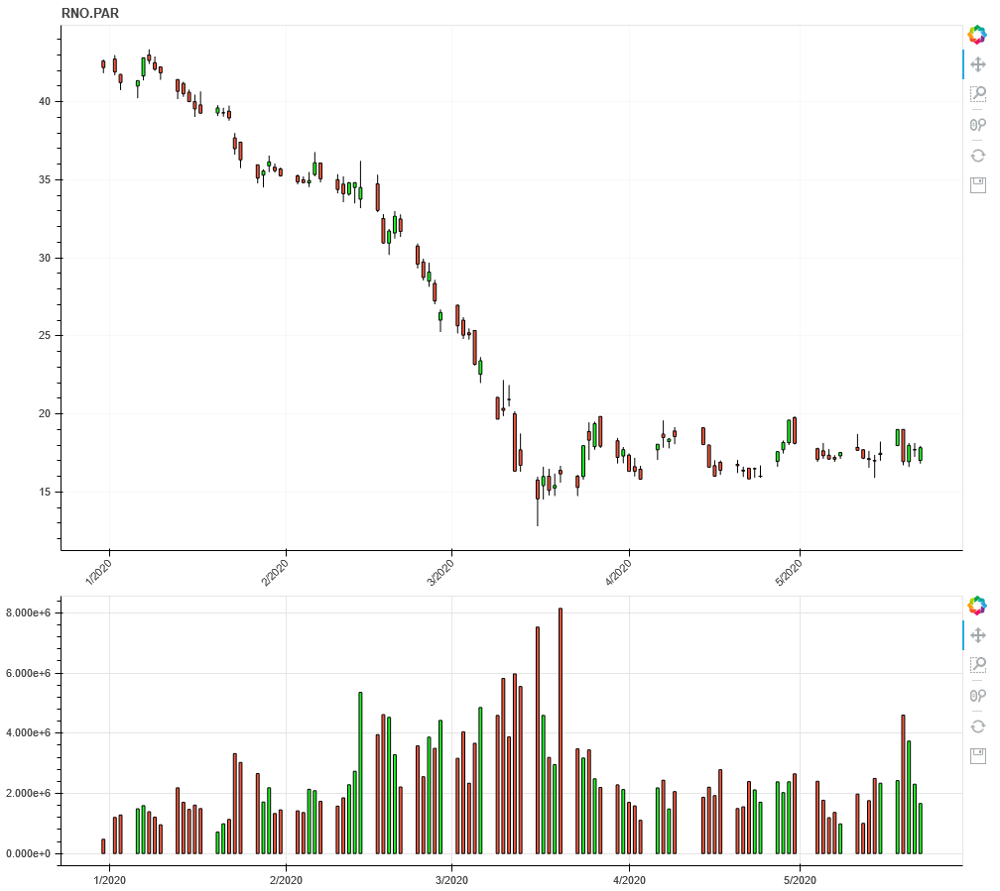

# bokeh_stocks
plot stocks value and more with python

Edit the ressources/config.ini file to set your alphavantage.co key.

From Docker directory :
docker build . -t bokeh_stocks
docker run --rm -v $PWD\..\ressourcces:/opt/app/ressources -p 5006:5006 --name plotstocks bokeh_stocks

You can view the result on http://localhost:5006/test1
You can edit ressouces/test1.py an reload the page ; the "--dev" option in the Dockerfile CMD section is there to allow dynamic reload.

